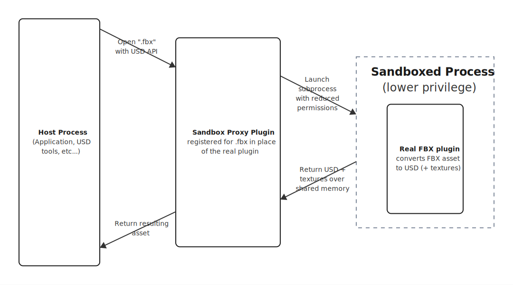
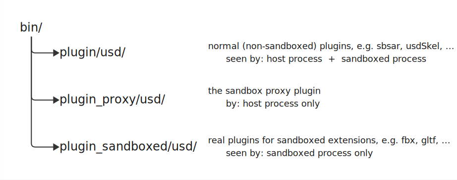

# Fileformat Plugin Sandboxing

Sandboxing is a **beta** feature: hardening is uneven across platforms and still being extended, the code is landing incrementally, and it shouldn't be relied on as a complete security boundary.

Sandboxing runs a fileformat plugin in a separate, lower-privilege process, confining vulnerabilities internal to the plugin or in third-party libraries (e.g. the FBX SDK used by the FBX plugin) to that subprocess rather than the host. A **sandbox proxy** plugin facilitates this: when sandboxing is enabled for a format (such as FBX), the proxy handles assets of that type (`.fbx`) in place of the real plugin. It launches the sandboxed process, which loads the real plugin (kept in a separate location) and converts the asset exactly as it would unsandboxed — just with fewer permissions and without knowing it is sandboxed.

<p align="center">
  
</p>

## Contents

- [Building and enabling sandboxing](#building-and-enabling-sandboxing)
- [Security model and limitations](#security-model-and-limitations)
- [File format arguments](#file-format-arguments)
- [Notes and limitations](#notes-and-limitations)
- [Troubleshooting](#troubleshooting)
- [How it works](#how-it-works)

## Building and enabling sandboxing

Sandboxing is configured **per plugin at build time**. The choice is baked into the build and is used by any consumer, whether a USD tool or an application that links the plugins. Every per-plugin flag **defaults OFF**, so a build provides no isolation for a format unless that format's flag is explicitly enabled.

These plugins can be sandboxed:

- FBX
- GLTF
- OBJ
- PLY
- SPZ
- STL

SBSAR does not support sandboxing.

### Build flags

Enable sandboxing for a format by passing `-DUSD_FILEFORMATS_<FORMAT>_SANDBOX=ON` as one of the `<OPTIONS>` on the standard configure line (see the build steps in the [main repository README](../README.md)):

```bash
cmake -S . -B build -DCMAKE_INSTALL_PREFIX=bin -DUSD_FILEFORMATS_FBX_SANDBOX=ON ...
```

Sandboxing a format also requires that format's plugin to be enabled — `-DUSD_FILEFORMATS_ENABLE_FBX=ON`, which is on by default. The authoritative list of flags and their defaults lives in the top-level [`CMakeLists.txt`](../CMakeLists.txt).

If you change a sandbox flag, **a clean build is required** to remove stale plugins from the sandbox or non-sandbox plugin folders.

### Plugin folder layout

Enabling sandboxing produces a **3-folder layout** — the normal plugins, the proxy, and the sandboxed (real) plugins each get their own directory:

<p align="center">
  
</p>

Because only one plugin can register a given format, the proxy and the real sandboxed plugins cannot share a directory. They are kept apart so the host process finds the proxy while the subprocess finds the real plugins, and both are never registered together.

### Using or bypassing sandboxing at runtime

USD finds plugins via `PXR_PLUGINPATH_NAME` (entries separated by `:` on macOS/Linux, `;` on Windows). Sandboxing is selected at runtime by which directories you put on that path, so it can be turned on or off without rebuilding:

- **To use sandboxing:** include the proxy directory. The sandboxed process is then launched automatically with a path that finds the real plugins but not the proxy.
- **To bypass sandboxing:** leave the proxy out and point directly at the sandboxed (real) plugins.

```bash
# macOS / Linux

# Use sandboxing: normal + proxy plugin directories
export PXR_PLUGINPATH_NAME="/path/to/bin/plugin/usd:/path/to/bin/plugin_proxy/usd"

# Bypass sandboxing: normal + sandboxed (real) plugins directly, skipping the proxy
export PXR_PLUGINPATH_NAME="/path/to/bin/plugin/usd:/path/to/bin/plugin_sandboxed/usd"
```

```powershell
# Windows PowerShell

# Use sandboxing
$env:PXR_PLUGINPATH_NAME = "C:\path\to\bin\plugin\usd;C:\path\to\bin\plugin_proxy\usd"

# Bypass sandboxing
$env:PXR_PLUGINPATH_NAME = "C:\path\to\bin\plugin\usd;C:\path\to\bin\plugin_sandboxed\usd"
```

### Confirming sandboxing is active

The sandbox is deliberately transparent, so a sandboxed conversion returns the same result as the in-process plugin, so there is no obvious external signal. The reliable indicator is a warning the host prints on every sandboxed import:

```
(HOST) Using sandbox to read asset: <asset>
```

Export currently prints no equivalent warning; use the debug flag below to confirm a sandboxed export.

For a full trace, set `TF_DEBUG=FILE_FORMAT_SANDBOXPROXY` to print every sandbox proxy message, many tagged `(HOST)` or `(SANDBOX)` to show which process emitted them. The wildcard `TF_DEBUG=FILE_FORMAT*` also enables these (along with the other file-format plugins' debug output).

### Runtime prerequisites

On Linux, the worker enters new user, mount, and network namespaces via `unshare`. If the host doesn't permit unprivileged namespace creation, whether disabled by a kernel setting or restricted by a host or container security policy, the subprocess **fails to launch** (`sandbox: post-fork hardening failed to unshare namespaces; sandboxed process will not start`). This is common on hardened hosts and some default container runtimes. (Writing the uid/gid map is a softer requirement: if the namespace is created but the map write is denied, no action is needed; the worker still launches fully confined, just as the unmapped overflow user.)

macOS and Windows have no comparable host prerequisite.

## Security model and limitations

Sandboxing is **one layer of defense, not the sole security control.** These plugins read attacker-controlled file content and must be memory-safe on their own; the sandbox reduces the blast radius of a vulnerability, it does not license unsafe parsing.

It is also **opt-in and OFF by default.** Every per-plugin sandbox flag defaults OFF (`USD_FILEFORMATS_<FORMAT>_SANDBOX`), so a build gets **no isolation** unless a plugin is explicitly enabled.

On every platform the parser runs in a **separate, lower-privilege subprocess**, so a crash or memory-corruption exploit is contained there rather than in the host process. The per-platform OS hardening below is layered on top of that isolation, and it is **uneven across platforms**. Do not assume a sandboxed parser is uniformly blocked from the filesystem, the network, or spawning processes; what actually holds on each platform is described below.

### macOS (applied via `sandbox-exec`)

Enforced:

- **Default-deny sandbox profile** (`(deny default)`). File-content reads are limited to the asset source directory (import only), the temp directory, the required library paths, and internationalization libraries (`/usr/share/i18n`); writes are limited to the asset/export directory (export only) and the temp directory.
- **Network is denied** by the default-deny — no network rule is granted.

Not enforced / broad:

- **Broad temp access** — `/private/tmp` is granted both read and write, and `TMPDIR` is repointed there for the worker.
- `sandbox-exec` itself is **deprecated** by Apple (still widely used, including by Apple's own tools).

### Windows

Enforced:

- **Import: the process integrity level is lowered to Low** (`S-1-16-4096`) before any untrusted parsing. Under Windows Mandatory Integrity Control this blocks the worker from *writing* to the higher-integrity objects the host and user own — files, registry keys, and named kernel objects at medium integrity or above — and from tampering with higher-integrity processes (no code injection, restricted window messages).

Not enforced:

- Low integrity is a **write-up restriction only** — it does not restrict reads or network egress, so the worker can still read most user-readable files and open network connections. **Network egress is not denied on Windows.**
- **Beyond low integrity there is no further OS confinement** — no AppContainer/lowbox token, restricted token, job-object limit, or process-mitigation policy.
- **Export applies no OS hardening at all** — the export subprocess is unsandboxed; only the process isolation above applies.

### Linux

Enforced:

- **seccomp syscall filter** — a *blocklist* (default-allow with specific syscalls killed), **not** a default-deny allow-list. It kills process spawning (`execve`, `fork`, `vfork`), `ptrace`, `socket`/`connect` (network), and privilege/module/mount syscalls (`setuid`, `capset`, `mount`, `init_module`, `reboot`, …).
- **User, mount, and network namespaces** and **`no_new_privs`**. The network namespace isolates egress (redundant with the seccomp `socket`/`connect` kills).

Not enforced:

- **No capability drop** — capabilities already held are not dropped (the seccomp filter blocks `capset`, but that is not the same as dropping inherited capabilities).
- **No restricted filesystem view** — the mount namespace is created but never used to scope the filesystem, so the parser can still **read any file the mapped user can read.**

### Network egress at a glance

| Platform | Import worker | Export worker |
|---|---|---|
| macOS | Denied (default-deny profile) | Denied (same enforcement as import) |
| Windows | **Not denied** (low IL does not restrict network) | Not denied (export is unsandboxed) |
| Linux | Denied (network namespace + seccomp `socket`/`connect`) | Denied (same enforcement as import) |

## File format arguments

The sandbox proxy handles a small set of file format arguments on the host, consuming them before the argument map is sent to the sandboxed worker. They apply to any sandboxed format, but only take effect when that format is built with sandboxing enabled — with sandboxing off, the proxy is not in the pipeline and the argument is silently ignored.

| Argument | Effect |
|---|---|
| `assetsPath` | Directory where processed textures are written during import. Under sandboxing this is also the workaround for textures that cannot otherwise be loaded from a separate process (see the texture note under [Notes and limitations](#notes-and-limitations)). The syntax is the same for every format (example below); see the per-format READMEs for defaults and format-specific behavior. |
| `sandboxAllowLargeAssets` | `true` lifts the cap on the asset size the sandboxed worker reports back to the host. By default the host rejects any reported size of 4 GiB or more. The cap guards the host against a compromised worker reporting an inflated size to force a large allocation, so enabling this disables that protection — use only for trusted inputs that are legitimately 4 GiB or larger. |

```python
# Write textures to disk during import so they survive the sandboxed worker exiting
stage = Usd.Stage.Open("asset.gltf:SDF_FORMAT_ARGS:assetsPath=/path/to/textures")

# Allow assets 4 GiB or larger (trusted inputs only)
stage = Usd.Stage.Open("asset.fbx:SDF_FORMAT_ARGS:sandboxAllowLargeAssets=true")
```

## Notes and limitations

- **Debuggers can't step across the sandbox boundary** into the subprocess that loads the file. To debug a plugin's import/export code, bypass sandboxing (or turn its sandbox flag off) and rebuild.
- Sandboxed conversions launch a subprocess and copy the results over shared memory, so they may be slower than in-process conversion.
- **Imports reject asset data of 4 GiB or more by default.** This bounds the size the subprocess can ask the host to allocate. The `sandboxAllowLargeAssets` file format argument lifts the cap for trusted large inputs, at the cost of that safety check.
- **Some methods of loading textures are not yet supported under sandboxing.** Normally textures are loaded lazily on demand by re-invoking the plugin. With sandboxing, once the subprocess exits the real plugin is gone, so a texture requested later **from a different process will not be found.** Either request textures from the same process that first converted the asset, or use the `assetsPath` argument to have textures written out eagerly during the first conversion.

## Troubleshooting

| Symptom | Likely cause | Fix |
|---|---|---|
| On Linux, the subprocess won't launch: the host logs `(HOST) Failed to launch unsafe process`, and the child prints `sandbox: post-fork hardening failed to unshare namespaces; ...` to stderr | The host or container doesn't permit unprivileged namespace creation | See [Runtime prerequisites](#runtime-prerequisites) |
| No `(HOST) Using sandbox to read asset` warning on import | The proxy isn't on the plugin path, or the format wasn't built sandboxed | Add the proxy directory to `PXR_PLUGINPATH_NAME` (see [Using or bypassing sandboxing at runtime](#using-or-bypassing-sandboxing-at-runtime)); confirm the format's `_SANDBOX` build flag was set |
| Textures missing when accessed after import | The texture was requested from a different process after the worker exited | Use `assetsPath` to write textures during the first conversion — see the texture note under [Notes and limitations](#notes-and-limitations) |

## How it works

### High level

1. A **sandbox proxy plugin** handles conversions of all sandboxed fileformats.
2. Under the hood, the proxy launches a separate process with fewer permissions and tells it which file to convert.
3. The **sandboxed process** loads the source file and converts it using the real plugin, alongside any referenced textures.
4. Using **shared memory** accessible by both processes, the sandboxed process sends the converted USD and all associated textures to the host process, then terminates.
5. The **host process** reads the converted USD and its textures from shared memory, shuts down the interprocess communication channels, and returns the resulting asset.

### Detailed process

#### For import (to USD)

<details>
<summary><b>1. Use the sandbox proxy plugin</b></summary>

- Fileformat plugins are registered with USD via a `plugInfo.json` that references the plugin and the extensions it opens.
- For sandboxed formats, the extensions are registered with the **sandbox proxy plugin** instead of the real (unsafe) plugin. For example, `.gltf`/`.glb` are opened by the proxy.
- The proxy is installed to its own directory (`plugin_proxy/usd`), which must be on `PXR_PLUGINPATH_NAME`. The real plugins are installed elsewhere (`plugin_sandboxed/usd`).

</details>

<details>
<summary><b>2. Launch the sandboxed process</b></summary>

- The proxy creates an inter-process communication (IPC) channel and launches a second process — the sandboxed process — which runs a separate executable that performs the conversion. Two-way anonymous pipes let the host and child communicate. The executable's location is read from the `plugInfo`.
- OS-level restrictions are then applied (see [Security model and limitations](#security-model-and-limitations)):
  - **macOS:** the executable is launched under `sandbox-exec` with a generated default-deny profile.
  - **Linux:** after launch the child enters restricted namespaces and installs a seccomp syscall filter before any untrusted parsing.
  - **Windows:** the child lowers its own integrity level to Low before any untrusted code runs.
- To prevent the subprocess from re-discovering the proxy (which would cause infinite recursion), the proxy's directory is replaced with the sandboxed-plugins directory in the subprocess's `PXR_PLUGINPATH_NAME`. The subprocess registers the real plugins directly from that path.

</details>

<details>
<summary><b>3. Convert the asset (in the sandboxed process)</b></summary>

- The host sends the fileformat arguments to the subprocess over the pipes.
- The subprocess opens the source asset with the USD API, which finds and uses the real fileformat plugin. The result is an `SdfLayer` representing the converted asset.
- The layer is "exported" to an in-memory URI (prefixed `InMemory://`, extension `.usdc`) handled by a custom **InMemoryResolver**, which holds the resulting USDC data.
- The subprocess traverses the layer to find every referenced external asset (textures), saving each path once, so they can be loaded before the subprocess exits (afterward the real plugin is no longer available).

</details>

<details>
<summary><b>4. Set up shared memory</b></summary>

- All assets to send (the USDC data plus every referenced texture) are opened as `ArAsset` objects, and their total size is summed by an **AssetWriter**.
- The subprocess sends the total size to the host over the pipes. If the pipes close first, the host knows the conversion failed or crashed.
- The reported size is untrusted input: before allocating, the host rejects any size of 4 GiB or more (unless `sandboxAllowLargeAssets` is set), preventing a compromised worker from forcing an unbounded allocation.
- The host allocates a shared-memory block of the required size and sends its name back to the subprocess, which connects to it.

</details>

<details>
<summary><b>5. Send the converted asset (subprocess → host)</b></summary>

- The AssetWriter writes a table of contents (each asset's path and its offset) into shared memory, followed by each asset's data block (size + bytes).
- Once everything is written, the subprocess terminates.

</details>

<details>
<summary><b>6. Read the converted asset (in the host process)</b></summary>

- An **AssetReader** interprets the shared memory, iterating the table of contents to recover every asset and its path.
- The USDC asset (the `InMemory://….usdc` URI) is opened via the InMemoryResolver and registered.
- The remaining assets (textures) are stored in a **SandboxAssetCache**.
- The host exports the in-memory layer to the requested USD path.
- When a texture is later requested, a custom package resolver serves it from the SandboxAssetCache (the real plugin is no longer available in the host).

</details>

#### For export (from USD)

Export reuses the same proxy and subprocess launch as import, with the data flowing the other way:

<details>
<summary><b>Export specifics</b></summary>

- The host gathers all `ArAsset`s referenced by the USD to be exported. Each referenced asset path is rewritten with the `InMemory://` prefix so the subprocess reads it from shared memory rather than disk.
- The layer is packaged as an in-memory `ArAsset` (as in import), and the host writes the USDC data and all textures into shared memory.
- The subprocess reads them back (all under the `InMemory://` prefix, so they resolve through the InMemoryResolver), opens the in-memory layer, and exports it to the requested path using the real plugin. Because textures carry the in-memory prefix, they are found and exported automatically.

</details>

Sandboxing on export matters less than on import: triggering a vulnerability in an external library is far easier with a native file of that type (e.g. an `.fbx`) than with a USD that must first be converted. On **macOS and Linux, export is sandboxed the same as import.** On **Windows, export still runs in a separate subprocess (process isolation) but no OS-level hardening is applied to it yet.**
